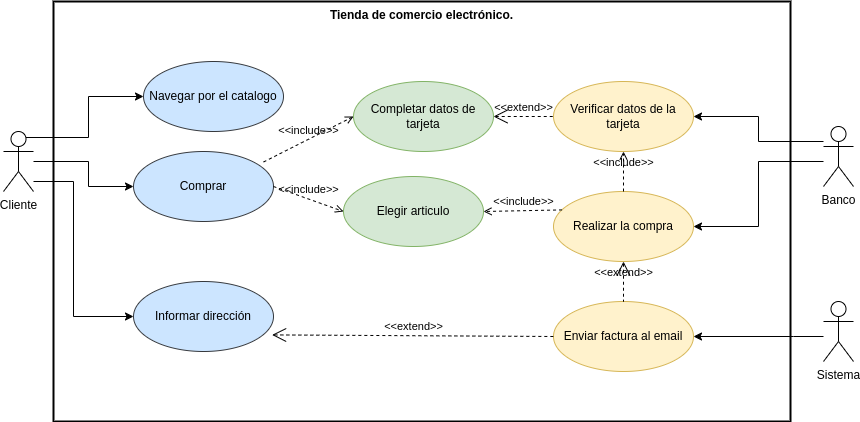
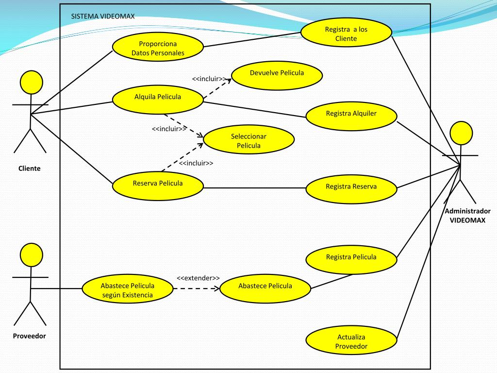

# Tienda de comercio electronico

## Diagrama de uso

## Especificaciones de lso actores y casos de uso

### Actores

   #### Cliente

|  Actor | Cliente|
|---|---|
| Descripción  | Persona interesada en comprar. |
| Características  ||
| Relaciones |  |
| Referencias | Navegar por el catalogo, Comprar e informar dirección|   
|  Notas ||
| Autor  | Nicolás Expósito Hernández |
|Fecha | 05/11/2024 |

   #### Banco

|  Actor | Banco|
|---|---|
| Descripción  | Actor externo que se encarga del tramite de pago |
| Características  ||
| Relaciones |  |
| Referencias | Verificar datos de la tarjeta, realizar compra y enviar facturas|   
|  Notas ||
| Autor  | Nicolás Expósito Hernández |
|Fecha | 05/11/2024 |

#### Sistema

|  Actor | Sistema|
|---|---|
| Descripción  | Se encarga de enviar facturas al usuarui|
| Características  ||
| Relaciones |  |
| Referencias | Enviar facturas|   
|  Notas ||
| Autor  | Nicolás Expósito Hernández |
|Fecha | 05/11/2024 |

## Casos de uso

### Autor

#### Navegar por el catalogo

|  Caso de Uso	CU.1 | Navegar por el catalogo |
  |---|---|
  | Fuentes  | Este caso de uso se sustenta gracias al [documeto](). |
  | Actor  |  Usuario general, |
  | Descripción | Navegar por la aplicacion para ver los productos |
  | Flujo básico ||
  | Pre-condiciones | |  
  | Post-condiciones  | |  
  |  Requerimientos |  |
  |  Notas |  |
  | Autor  | nexphernandez |
  |Fecha | 05/11/2024|

#### Compra

|  Caso de Uso	CU.2 | compra |
  |---|---|
  | Fuentes  | Este caso de uso se sustenta gracias al [documeto](). |
  | Actor  |  Usuario general, |
  | Descripción | El cliente compra un producto |
  | Flujo básico ||
  | Pre-condiciones |Elegir artículo y completar datos de la tarjeta |  
  | Post-condiciones  | realizar compra |  
  |  Requerimientos |  |
  |  Notas |  |
  | Autor  | nexphernandez |
  |Fecha | 05/11/2024|

#### Informar direccion

|  Caso de Uso	CU.3 | informar direccion |
  |---|---|
  | Fuentes  | Este caso de uso se sustenta gracias al [documeto](). |
  | Actor  |  Usuario general, |
  | Descripción | El cliente indica el lugar donde se envia el producto|
  | Flujo básico ||
  | Pre-condiciones ||  
  | Post-condiciones  | |  
  |  Requerimientos |  |
  |  Notas |  |
  | Autor  | nexphernandez |
  |Fecha | 05/11/2024|

### Banco

#### Verificar datos de la tarjeta

|  Caso de Uso	CU.1 | Verificar datos de la tarjeta |
  |---|---|
  | Fuentes  | Este caso de uso se sustenta gracias al [documeto](). |
  | Actor  |  Banco |
  | Descripción | Se verifica que los datos de la tarjeta sean correctos|
  | Flujo básico ||
  | Pre-condiciones | Completar datos de la tarjeta |  
  | Post-condiciones  | |  
  |  Requerimientos |  |
  |  Notas |  |
  | Autor  | nexphernandez |
  |Fecha | 05/11/2024|

  #### Realizar compra

|  Caso de Uso	CU.2 | Realizar compra |
  |---|---|
  | Fuentes  | Este caso de uso se sustenta gracias al [documeto](). |
  | Actor  |  Banco |
  | Descripción | Da permiso para que se realize la compra o no|
  | Flujo básico ||
  | Pre-condiciones | Elegir articulo |  
  | Post-condiciones  | |  
  |  Requerimientos |  |
  |  Notas |  |
  | Autor  | nexphernandez |
  |Fecha | 05/11/2024|

### Sistema

#### Enviar una factura al email

|  Caso de Uso	CU.1 | Enviar una factura al email |
  |---|---|
  | Fuentes  | Este caso de uso se sustenta gracias al [documeto](). |
  | Actor  |  Sistema |
  | Descripción | Se envia un mensaje al email del cliente cuando se realice una compra|
  | Flujo básico ||
  | Pre-condiciones ||  
  | Post-condiciones  | |  
  |  Requerimientos |  |
  |  Notas |  |
  | Autor  | nexphernandez |
  |Fecha | 05/11/2024|

# Sistema Videomax

## Especificación de Actores y Operaciones

### Actores

   #### Cliente

|  Actor | Cliente|
|---|---|
| Descripción  | Persona interesada en alquilar una pelicula. |
| Características  ||
| Relaciones |  |
| Referencias | Proporcional datos personales, alquilar pelicula y reservar una pelicula|   
|  Notas ||
| Autor  | Nicolás Expósito Hernández |
|Fecha | 05/11/2024 |

   #### Proveedor

|  Actor | Proveedo|
|---|---|
| Descripción  | Actor que se encarga de abastecer el stock si es necesario |
| Características  ||
| Relaciones |  |
| Referencias | Abastece peliculas segin existencia|   
|  Notas ||
| Autor  | Nicolás Expósito Hernández |
|Fecha | 05/11/2024 |

   #### Admisnistrador VideoMax

|  Actor | Admisnistrador VideoMax|
|---|---|
| Descripción  | Se encarga de que funcione el sistema|
| Características  ||
| Relaciones |  |
| Referencias | Registra a los clientes, Registrar alquiler, Registra reserva, Registra pelicula y Actualiza proveedor|   
|  Notas ||
| Autor  | Nicolás Expósito Hernández |
|Fecha | 05/11/2024 |

## Casos de uso

### Cliente

#### Proporciona datos personales

|  Caso de Uso	CU.1 | Proporciona datos personales |
  |---|---|
  | Fuentes  | Este caso de uso se sustenta gracias al [documeto](). |
  | Actor  |  Cliente |
  | Descripción | Ingresa sus datos en el sistema |
  | Flujo básico ||
  | Pre-condiciones | |  
  | Post-condiciones  | Se genera un registro |  
  |  Requerimientos ||
  |  Notas |  |
  | Autor  | nexphernandez |
  |Fecha | 05/11/2024|

  #### Alquilar Pelicula

|  Caso de Uso	CU.2 | Alquilar Pelicula |
  |---|---|
  | Fuentes  | Este caso de uso se sustenta gracias al [documeto](). |
  | Actor  |  Cliente |
  | Descripción | Alquila la pelicula deseada |
  | Flujo básico ||
  | Pre-condiciones | |  
  | Post-condiciones  | Seleccionar pelicula, devolder la pelicula |  
  |  Requerimientos ||
  |  Notas |  |
  | Autor  | nexphernandez |
  |Fecha | 05/11/2024|

   #### Reservar Pelicula

|  Caso de Uso	CU.3 | Reservar Pelicula |
  |---|---|
  | Fuentes  | Este caso de uso se sustenta gracias al [documeto](). |
  | Actor  |  Cliente |
  | Descripción | Reserva la pelicula deseada |
  | Flujo básico ||
  | Pre-condiciones | |  
  | Post-condiciones  | Seleccionar pelicula|  
  |  Requerimientos ||
  |  Notas |  |
  | Autor  | nexphernandez |
  |Fecha | 05/11/2024|

### Proveedor

#### Abastecer pelicula

|  Caso de Uso	CU.1 | Abastecer pelicula |
  |---|---|
  | Fuentes  | Este caso de uso se sustenta gracias al [documeto](). |
  | Actor  |  Proveedor |
  | Descripción | Abastece peliculas segun las existencia|
  | Flujo básico ||
  | Pre-condiciones | |  
  | Post-condiciones  | Abastece pelicula |  
  |  Requerimientos ||
  |  Notas |  |
  | Autor  | nexphernandez |
  |Fecha | 05/11/2024|

### Administrador VideoMax

#### Registar a los clientes

|  Caso de Uso	CU.1 | Registar a los clientes |
  |---|---|
  | Fuentes  | Este caso de uso se sustenta gracias al [documeto](). |
  | Actor  |  Administrador VideoMax |
  | Descripción | Regitrar clientes en el sistema|
  | Flujo básico ||
  | Pre-condiciones | |  
  | Post-condiciones  | |  
  |  Requerimientos ||
  |  Notas |  |
  | Autor  | nexphernandez |
  |Fecha | 05/11/2024|

#### Registar alquiler

|  Caso de Uso	CU.2 | Registar alquiler |
  |---|---|
  | Fuentes  | Este caso de uso se sustenta gracias al [documeto](). |
  | Actor  |  Administrador VideoMax |
  | Descripción | Regitra las peliculas alquiladas en el sistema|
  | Flujo básico ||
  | Pre-condiciones | |  
  | Post-condiciones  | |  
  |  Requerimientos ||
  |  Notas |  |
  | Autor  | nexphernandez |
  |Fecha | 05/11/2024|

#### Registar Reserva

|  Caso de Uso	CU.3 | Registar reserva |
  |---|---|
  | Fuentes  | Este caso de uso se sustenta gracias al [documeto](). |
  | Actor  |  Administrador VideoMax |
  | Descripción | Regitra las peliculas reservadas en el sistema|
  | Flujo básico ||
  | Pre-condiciones | |  
  | Post-condiciones  | |  
  |  Requerimientos ||
  |  Notas |  |
  | Autor  | nexphernandez |
  |Fecha | 05/11/2024|

#### Registar peliculas

|  Caso de Uso	CU.4 | Registar peliculas |
  |---|---|
  | Fuentes  | Este caso de uso se sustenta gracias al [documeto](). |
  | Actor  |  Administrador VideoMax |
  | Descripción | Regitra las peliculas abastecidas en el sistema|
  | Flujo básico ||
  | Pre-condiciones | |  
  | Post-condiciones  | |  
  |  Requerimientos ||
  |  Notas |  |
  | Autor  | nexphernandez |
  |Fecha | 05/11/2024|

#### Actualiza proveedor

|  Caso de Uso	CU.5 | Actualizar proveedor |
  |---|---|
  | Fuentes  | Este caso de uso se sustenta gracias al [documeto](). |
  | Actor  |  Administrador VideoMax |
  | Descripción | Le indica el proveedor que tiene que actualizar el stock|
  | Flujo básico ||
  | Pre-condiciones | |  
  | Post-condiciones  | |  
  |  Requerimientos ||
  |  Notas | Se considera que este caso de uso deberia estar relacionado con el proveedor |
  | Autor  | nexphernandez |
  |Fecha | 05/11/2024|